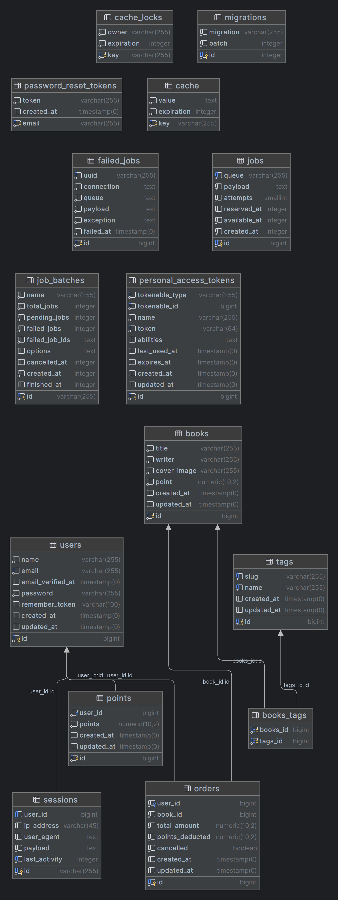

# book-store
# 📁 Folder: books


## End-point: Create a new book
Crea a new book
### Method: POST
>```
>http://127.0.0.1:8000/api/books
>```
### Headers

|Content-Type|Value|
|---|---|
|Accept|application/json|


### Body formdata

|Param|value|Type|
|---|---|---|
|title|Book 1|text|
|writer|Admin|text|
|cover_image|/C:/Users/Pictures/Bandiagara.jpg|file|
|point|10|default|
|tags|fiction, science|default|


### 🔑 Authentication bearer

|Param|value|Type|
|---|---|---|
|token|6|jYv6TMR4U0kvgCIxybCSAMop0E2R4WyepsEMQYDb150eb4b8|string|


### Response: 201
```json
{
    "message": "Book Added"
}
```


⁃ ⁃ ⁃ ⁃ ⁃ ⁃ ⁃ ⁃ ⁃ ⁃ ⁃ ⁃ ⁃ ⁃ ⁃ ⁃ ⁃ ⁃ ⁃ ⁃ ⁃ ⁃ ⁃ ⁃ ⁃ ⁃ ⁃ ⁃ ⁃ ⁃ ⁃ ⁃ ⁃ ⁃ ⁃ ⁃ ⁃ ⁃ ⁃ ⁃ ⁃ ⁃ ⁃ ⁃ ⁃ ⁃ ⁃

## End-point: Get books
Get books listing
### Method: GET
>```
>http://127.0.0.1:8000/api/books?page=1&sortBy=point&sortOrder=asc&tags=science&perPage=9&search=eos
>```
### Headers

|Content-Type|Value|
|---|---|
|Accept|application/json|


### Body formdata

|Param|value|Type|
|---|---|---|


### Query Params

|Param|value|
|---|---|
|page|1|
|sortBy|point|
|sortOrder|asc|
|tags|science|
|perPage|9|
|search|eos|


### 🔑 Authentication bearer

|Param|value|Type|
|---|---|---|
|token|2|nfvTyE3tjWFMnXMw7pBuHlMO9BPZqgFoSSpzHcln0b06d905|string|


### Response: 200
```json
{
    "current_page": 1,
    "data": [
        {
            "id": 132,
            "title": "Eos dolore minima.",
            "writer": "Nelda Muller",
            "cover_image": "https://images-na.ssl-images-amazon.com/images/I/51Ga5GuElyL._AC_SX184_.jpg",
            "point": "1.00",
            "created_at": "2024-04-28T12:01:19.000000Z",
            "updated_at": "2024-04-28T12:01:19.000000Z",
            "tags": "science, medical, fiction"
        },
        {
            "id": 211,
            "title": "Quia eos omnis tempore occaecati.",
            "writer": "Felix Sauer",
            "cover_image": "https://images-na.ssl-images-amazon.com/images/I/51Ga5GuElyL._AC_SX184_.jpg",
            "point": "75.00",
            "created_at": "2024-04-28T12:01:19.000000Z",
            "updated_at": "2024-04-28T12:01:19.000000Z",
            "tags": "science, travel, non-fiction"
        },
        {
            "id": 170,
            "title": "Ipsa eos minima.",
            "writer": "Mr. Zack Jast",
            "cover_image": "https://images-na.ssl-images-amazon.com/images/I/51Ga5GuElyL._AC_SX184_.jpg",
            "point": "81.00",
            "created_at": "2024-04-28T12:01:19.000000Z",
            "updated_at": "2024-04-28T12:01:19.000000Z",
            "tags": "science, medical, comics"
        }
    ],
    "first_page_url": "http://127.0.0.1:8000/api/books?page=1",
    "from": 1,
    "last_page": 1,
    "last_page_url": "http://127.0.0.1:8000/api/books?page=1",
    "links": [
        {
            "url": null,
            "label": "« Previous",
            "active": false
        },
        {
            "url": "http://127.0.0.1:8000/api/books?page=1",
            "label": "1",
            "active": true
        },
        {
            "url": null,
            "label": "Next »",
            "active": false
        }
    ],
    "next_page_url": null,
    "path": "http://127.0.0.1:8000/api/books",
    "per_page": 9,
    "prev_page_url": null,
    "to": 3,
    "total": 3
}
```


⁃ ⁃ ⁃ ⁃ ⁃ ⁃ ⁃ ⁃ ⁃ ⁃ ⁃ ⁃ ⁃ ⁃ ⁃ ⁃ ⁃ ⁃ ⁃ ⁃ ⁃ ⁃ ⁃ ⁃ ⁃ ⁃ ⁃ ⁃ ⁃ ⁃ ⁃ ⁃ ⁃ ⁃ ⁃ ⁃ ⁃ ⁃ ⁃ ⁃ ⁃ ⁃ ⁃ ⁃ ⁃ ⁃ ⁃

## End-point: Get book by ID
Get specific book by ID
### Method: GET
>```
>http://127.0.0.1:8000/api/books/128
>```
### Headers

|Content-Type|Value|
|---|---|
|Accept|application/json|


### Body formdata

|Param|value|Type|
|---|---|---|


### 🔑 Authentication bearer

|Param|value|Type|
|---|---|---|
|token|2|nfvTyE3tjWFMnXMw7pBuHlMO9BPZqgFoSSpzHcln0b06d905|string|


### Response: 200
```json
{
    "id": 128,
    "title": "Quidem quis laboriosam.",
    "writer": "Ila Dickinson",
    "cover_image": "https://images-na.ssl-images-amazon.com/images/I/51Ga5GuElyL._AC_SX184_.jpg",
    "point": "50.00",
    "created_at": "2024-04-28T12:01:19.000000Z",
    "updated_at": "2024-04-28T12:01:19.000000Z",
    "tags": "medical, sports, non-fiction"
}
```


⁃ ⁃ ⁃ ⁃ ⁃ ⁃ ⁃ ⁃ ⁃ ⁃ ⁃ ⁃ ⁃ ⁃ ⁃ ⁃ ⁃ ⁃ ⁃ ⁃ ⁃ ⁃ ⁃ ⁃ ⁃ ⁃ ⁃ ⁃ ⁃ ⁃ ⁃ ⁃ ⁃ ⁃ ⁃ ⁃ ⁃ ⁃ ⁃ ⁃ ⁃ ⁃ ⁃ ⁃ ⁃ ⁃ ⁃

## End-point: Delete book by ID
Delete book by ID
### Method: DELETE
>```
>http://127.0.0.1:8000/api/books/228
>```
### Headers

|Content-Type|Value|
|---|---|
|Accept|application/json|


### Body formdata

|Param|value|Type|
|---|---|---|


### 🔑 Authentication bearer

|Param|value|Type|
|---|---|---|
|token|6|jYv6TMR4U0kvgCIxybCSAMop0E2R4WyepsEMQYDb150eb4b8|string|


### Response: 202
```json
{
    "message": "Book Deleted"
}
```


⁃ ⁃ ⁃ ⁃ ⁃ ⁃ ⁃ ⁃ ⁃ ⁃ ⁃ ⁃ ⁃ ⁃ ⁃ ⁃ ⁃ ⁃ ⁃ ⁃ ⁃ ⁃ ⁃ ⁃ ⁃ ⁃ ⁃ ⁃ ⁃ ⁃ ⁃ ⁃ ⁃ ⁃ ⁃ ⁃ ⁃ ⁃ ⁃ ⁃ ⁃ ⁃ ⁃ ⁃ ⁃ ⁃ ⁃

## End-point: Update book by ID
Update book by ID
### Method: POST
>```
>http://127.0.0.1:8000/api/books/227
>```
### Headers

|Content-Type|Value|
|---|---|
|Accept|application/json|


### Body formdata

|Param|value|Type|
|---|---|---|
|title|test|default|
|_method|PUT|default|
|writer|test|text|
|point|2|text|
|tags|science|text|


### 🔑 Authentication bearer

|Param|value|Type|
|---|---|---|
|token|6|jYv6TMR4U0kvgCIxybCSAMop0E2R4WyepsEMQYDb150eb4b8|string|


### Response: 200
```json
{
    "message": "Book Updated"
}
```


⁃ ⁃ ⁃ ⁃ ⁃ ⁃ ⁃ ⁃ ⁃ ⁃ ⁃ ⁃ ⁃ ⁃ ⁃ ⁃ ⁃ ⁃ ⁃ ⁃ ⁃ ⁃ ⁃ ⁃ ⁃ ⁃ ⁃ ⁃ ⁃ ⁃ ⁃ ⁃ ⁃ ⁃ ⁃ ⁃ ⁃ ⁃ ⁃ ⁃ ⁃ ⁃ ⁃ ⁃ ⁃ ⁃ ⁃
# 📁 Folder: Orders


## End-point: Get all orders
Get all orders
### Method: GET
>```
>http://127.0.0.1:8000/api/orders?user_id=5&sortBy=id&sortOrder=desc&page=1&perPage=2
>```
### Headers

|Content-Type|Value|
|---|---|
|Accept|application/json|


### Query Params

|Param|value|
|---|---|
|user_id|5|
|sortBy|id|
|sortOrder|desc|
|page|1|
|perPage|2|


### 🔑 Authentication bearer

|Param|value|Type|
|---|---|---|
|token|4|rVQWLx8zPZS5XfzgQNJeYsOnq5rRtgb5UpYgosqjfccb5996|string|


### Response: 200
```json
{
    "current_page": 1,
    "data": [
        {
            "id": 18,
            "user_id": 5,
            "book_id": 132,
            "total_amount": "38.00",
            "points_deducted": "38.00",
            "cancelled": false,
            "created_at": "2024-04-28T12:09:16.000000Z",
            "updated_at": "2024-04-28T12:09:16.000000Z",
            "date": "2024-04-28 12:09:16",
            "book": {
                "id": 132,
                "title": "Eos dolore minima.",
                "writer": "Nelda Muller",
                "cover_image": "https://images-na.ssl-images-amazon.com/images/I/51Ga5GuElyL._AC_SX184_.jpg",
                "point": "1.00",
                "created_at": "2024-04-28T12:01:19.000000Z",
                "updated_at": "2024-04-28T12:01:19.000000Z"
            }
        },
        {
            "id": 13,
            "user_id": 5,
            "book_id": 132,
            "total_amount": "39.00",
            "points_deducted": "39.00",
            "cancelled": false,
            "created_at": "2024-04-28T12:08:42.000000Z",
            "updated_at": "2024-04-28T12:08:42.000000Z",
            "date": "2024-04-28 12:08:42",
            "book": {
                "id": 132,
                "title": "Eos dolore minima.",
                "writer": "Nelda Muller",
                "cover_image": "https://images-na.ssl-images-amazon.com/images/I/51Ga5GuElyL._AC_SX184_.jpg",
                "point": "1.00",
                "created_at": "2024-04-28T12:01:19.000000Z",
                "updated_at": "2024-04-28T12:01:19.000000Z"
            }
        }
    ],
    "first_page_url": "http://127.0.0.1:8000/api/orders?page=1",
    "from": 1,
    "last_page": 5,
    "last_page_url": "http://127.0.0.1:8000/api/orders?page=5",
    "links": [
        {
            "url": null,
            "label": "« Previous",
            "active": false
        },
        {
            "url": "http://127.0.0.1:8000/api/orders?page=1",
            "label": "1",
            "active": true
        },
        {
            "url": "http://127.0.0.1:8000/api/orders?page=2",
            "label": "2",
            "active": false
        },
        {
            "url": "http://127.0.0.1:8000/api/orders?page=3",
            "label": "3",
            "active": false
        },
        {
            "url": "http://127.0.0.1:8000/api/orders?page=4",
            "label": "4",
            "active": false
        },
        {
            "url": "http://127.0.0.1:8000/api/orders?page=5",
            "label": "5",
            "active": false
        },
        {
            "url": "http://127.0.0.1:8000/api/orders?page=2",
            "label": "Next »",
            "active": false
        }
    ],
    "next_page_url": "http://127.0.0.1:8000/api/orders?page=2",
    "path": "http://127.0.0.1:8000/api/orders",
    "per_page": 2,
    "prev_page_url": null,
    "to": 2,
    "total": 9
}
```


⁃ ⁃ ⁃ ⁃ ⁃ ⁃ ⁃ ⁃ ⁃ ⁃ ⁃ ⁃ ⁃ ⁃ ⁃ ⁃ ⁃ ⁃ ⁃ ⁃ ⁃ ⁃ ⁃ ⁃ ⁃ ⁃ ⁃ ⁃ ⁃ ⁃ ⁃ ⁃ ⁃ ⁃ ⁃ ⁃ ⁃ ⁃ ⁃ ⁃ ⁃ ⁃ ⁃ ⁃ ⁃ ⁃ ⁃

## End-point: Get order by ID
Get order by ID
### Method: GET
>```
>http://127.0.0.1:8000/api/orders/6
>```
### Headers

|Content-Type|Value|
|---|---|
|Accept|application/json|


### Body formdata

|Param|value|Type|
|---|---|---|


### 🔑 Authentication bearer

|Param|value|Type|
|---|---|---|
|token|4|rVQWLx8zPZS5XfzgQNJeYsOnq5rRtgb5UpYgosqjfccb5996|string|


### Response: 200
```json
{
    "id": 6,
    "user_id": 5,
    "book_id": 132,
    "total_amount": "48.00",
    "points_deducted": "48.00",
    "cancelled": false,
    "created_at": "2024-04-28T12:01:54.000000Z",
    "updated_at": "2024-04-28T13:12:29.000000Z"
}
```


⁃ ⁃ ⁃ ⁃ ⁃ ⁃ ⁃ ⁃ ⁃ ⁃ ⁃ ⁃ ⁃ ⁃ ⁃ ⁃ ⁃ ⁃ ⁃ ⁃ ⁃ ⁃ ⁃ ⁃ ⁃ ⁃ ⁃ ⁃ ⁃ ⁃ ⁃ ⁃ ⁃ ⁃ ⁃ ⁃ ⁃ ⁃ ⁃ ⁃ ⁃ ⁃ ⁃ ⁃ ⁃ ⁃ ⁃

## End-point: Create a new order
Create a new order
### Method: POST
>```
>http://127.0.0.1:8000/api/orders
>```
### Headers

|Content-Type|Value|
|---|---|
|Accept|application/json|


### Body formdata

|Param|value|Type|
|---|---|---|
|book_id|132|text|


### 🔑 Authentication bearer

|Param|value|Type|
|---|---|---|
|token|4|rVQWLx8zPZS5XfzgQNJeYsOnq5rRtgb5UpYgosqjfccb5996|string|


### Response: 200
```json
{
    "message": "Book purchased successfully"
}
```


⁃ ⁃ ⁃ ⁃ ⁃ ⁃ ⁃ ⁃ ⁃ ⁃ ⁃ ⁃ ⁃ ⁃ ⁃ ⁃ ⁃ ⁃ ⁃ ⁃ ⁃ ⁃ ⁃ ⁃ ⁃ ⁃ ⁃ ⁃ ⁃ ⁃ ⁃ ⁃ ⁃ ⁃ ⁃ ⁃ ⁃ ⁃ ⁃ ⁃ ⁃ ⁃ ⁃ ⁃ ⁃ ⁃ ⁃

## End-point: Delete order by ID
Delete order by ID
### Method: DELETE
>```
>http://127.0.0.1:8000/api/orders/46
>```
### Headers

|Content-Type|Value|
|---|---|
|Accept|application/json|


### Body formdata

|Param|value|Type|
|---|---|---|


### 🔑 Authentication bearer

|Param|value|Type|
|---|---|---|
|token|4|rVQWLx8zPZS5XfzgQNJeYsOnq5rRtgb5UpYgosqjfccb5996|string|


### Response: 202
```json
{
    "message": "Order Deleted"
}
```


⁃ ⁃ ⁃ ⁃ ⁃ ⁃ ⁃ ⁃ ⁃ ⁃ ⁃ ⁃ ⁃ ⁃ ⁃ ⁃ ⁃ ⁃ ⁃ ⁃ ⁃ ⁃ ⁃ ⁃ ⁃ ⁃ ⁃ ⁃ ⁃ ⁃ ⁃ ⁃ ⁃ ⁃ ⁃ ⁃ ⁃ ⁃ ⁃ ⁃ ⁃ ⁃ ⁃ ⁃ ⁃ ⁃ ⁃

## End-point: Update order by ID
Update order by ID
### Method: POST
>```
>http://127.0.0.1:8000/api/orders/6
>```
### Headers

|Content-Type|Value|
|---|---|
|Accept|application/json|


### Body formdata

|Param|value|Type|
|---|---|---|
|_method|PUT|default|
|cancelled|false|default|


### 🔑 Authentication bearer

|Param|value|Type|
|---|---|---|
|token|4|rVQWLx8zPZS5XfzgQNJeYsOnq5rRtgb5UpYgosqjfccb5996|string|


### Response: 200
```json
{
    "message": "Order Updated"
}
```


⁃ ⁃ ⁃ ⁃ ⁃ ⁃ ⁃ ⁃ ⁃ ⁃ ⁃ ⁃ ⁃ ⁃ ⁃ ⁃ ⁃ ⁃ ⁃ ⁃ ⁃ ⁃ ⁃ ⁃ ⁃ ⁃ ⁃ ⁃ ⁃ ⁃ ⁃ ⁃ ⁃ ⁃ ⁃ ⁃ ⁃ ⁃ ⁃ ⁃ ⁃ ⁃ ⁃ ⁃ ⁃ ⁃ ⁃

## End-point: Authorize Token Create
Create a user token for authentication
### Method: POST
>```
>http://127.0.0.1:8000/api/tokens/create?email=admin@gmail.com&password=12345678
>```
### Headers

|Content-Type|Value|
|---|---|
|Accept|application/json|


### Query Params

|Param|value|
|---|---|
|email|admin@gmail.com|
|password|12345678|


### Response: 200
```json
6|jYv6TMR4U0kvgCIxybCSAMop0E2R4WyepsEMQYDb150eb4b8
```


⁃ ⁃ ⁃ ⁃ ⁃ ⁃ ⁃ ⁃ ⁃ ⁃ ⁃ ⁃ ⁃ ⁃ ⁃ ⁃ ⁃ ⁃ ⁃ ⁃ ⁃ ⁃ ⁃ ⁃ ⁃ ⁃ ⁃ ⁃ ⁃ ⁃ ⁃ ⁃ ⁃ ⁃ ⁃ ⁃ ⁃ ⁃ ⁃ ⁃ ⁃ ⁃ ⁃ ⁃ ⁃ ⁃ ⁃

## End-point: Get all tags
Get all tags
### Method: GET
>```
>http://127.0.0.1:8000/api/tags
>```
### Headers

|Content-Type|Value|
|---|---|
|Accept|application/json|


### Body formdata

|Param|value|Type|
|---|---|---|


### 🔑 Authentication bearer

|Param|value|Type|
|---|---|---|
|token|2|nfvTyE3tjWFMnXMw7pBuHlMO9BPZqgFoSSpzHcln0b06d905|string|


### Response: 200
```json
[
    {
        "id": 19,
        "slug": "science",
        "name": "science",
        "created_at": "2024-04-27T15:52:31.000000Z",
        "updated_at": "2024-04-27T15:52:31.000000Z"
    },
    {
        "id": 20,
        "slug": "essay",
        "name": "essay",
        "created_at": "2024-04-27T15:52:31.000000Z",
        "updated_at": "2024-04-27T15:52:31.000000Z"
    },
    {
        "id": 21,
        "slug": "travel",
        "name": "travel",
        "created_at": "2024-04-27T15:52:31.000000Z",
        "updated_at": "2024-04-27T15:52:31.000000Z"
    },
    {
        "id": 22,
        "slug": "medical",
        "name": "medical",
        "created_at": "2024-04-27T15:52:31.000000Z",
        "updated_at": "2024-04-27T15:52:31.000000Z"
    },
    {
        "id": 23,
        "slug": "sports",
        "name": "sports",
        "created_at": "2024-04-27T15:52:31.000000Z",
        "updated_at": "2024-04-27T15:52:31.000000Z"
    },
    {
        "id": 24,
        "slug": "fiction",
        "name": "fiction",
        "created_at": "2024-04-27T15:52:31.000000Z",
        "updated_at": "2024-04-27T15:52:31.000000Z"
    },
    {
        "id": 25,
        "slug": "non-fiction",
        "name": "non-fiction",
        "created_at": "2024-04-27T15:52:31.000000Z",
        "updated_at": "2024-04-27T15:52:31.000000Z"
    },
    {
        "id": 26,
        "slug": "history",
        "name": "history",
        "created_at": "2024-04-27T15:52:31.000000Z",
        "updated_at": "2024-04-27T15:52:31.000000Z"
    },
    {
        "id": 27,
        "slug": "comics",
        "name": "comics",
        "created_at": "2024-04-27T15:52:31.000000Z",
        "updated_at": "2024-04-27T15:52:31.000000Z"
    }
]
```


⁃ ⁃ ⁃ ⁃ ⁃ ⁃ ⁃ ⁃ ⁃ ⁃ ⁃ ⁃ ⁃ ⁃ ⁃ ⁃ ⁃ ⁃ ⁃ ⁃ ⁃ ⁃ ⁃ ⁃ ⁃ ⁃ ⁃ ⁃ ⁃ ⁃ ⁃ ⁃ ⁃ ⁃ ⁃ ⁃ ⁃ ⁃ ⁃ ⁃ ⁃ ⁃ ⁃ ⁃ ⁃ ⁃ ⁃


